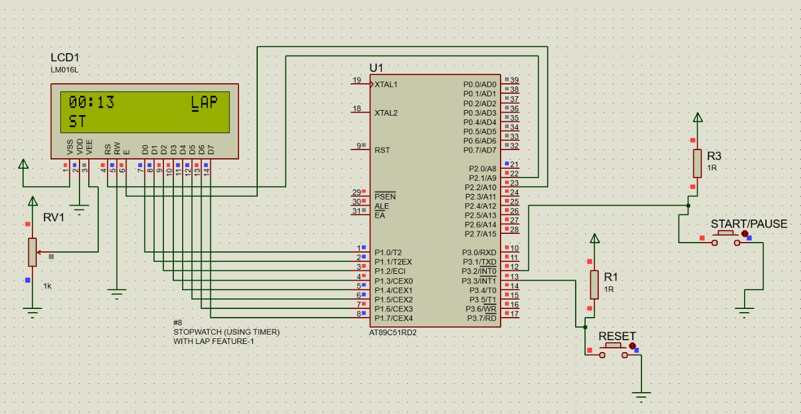

# 8051-stopwatch-assembly-keil-proteus

A digital stopwatch implemented on the **8051 microcontroller** with the following features:

- Start / Pause / Reset
- Lap timing functionality
- Interrupt-driven button control (INT0 & INT1)
- Timer-based 1-second counting (50ms × 20 overflows)
- 16x2 LCD display
- Power-efficient Idle Mode (PCON)

Simulated in **Proteus** and implemented on **P89V51RD2 development board**.


## Tools used
- Hardware
    - 8051 DEVELOPMENT BOARD -(PS-8051-EVB-V4)

    -  LCD Module - (PS-LCD-ADDON-V2)
- Software
    - KeiluVision , Flash Magic
   
    - Proteus 
##  Features  


- **Four operating states**  
  - `0` → Reset  
  - `1` → Running  
  - `2` → Paused  
  - `3` → Lap  
- **External interrupts used for button inputs**  
- **Accurate time counting** using Timer1  
- **Lap mode shows LAP once while time continues in background**  
- **Reset & Pause enter low-power IDLE mode**  


---

## Images

<details>
<summary><strong>Click to view screenshots & images</strong></summary>

### Circuit Schematic  


### Hardware  


</details>


##  Repository Structure
```
├── README.md
├── /code
│ └── main.asm #  assembly code
│
├── /proteus
│ ├── Stopwatch.pdsprj # Proteus project
│ └── main.hex # 
│
├── /assets
│ ├── schematic.png #Proteus
│ ├── hardware.jpg 
│ └── demo.gif # *todo
│
└── /docs
├── detailed.md # Detailed explanations
└── error.md  
```
---

## HOW TO USE?

### 🔹 **1. Load the HEX file in Proteus**
1. Open `Stopwatch.pdsprj`
2. Double-click the microcontroller
3. Browse → select `main.hex`
4. Run the simulation

### 🔹 **2. Hardware Setup**
- Use **P89V51RD2** or **AT89C51RD2**
- Connect **LCD** in 8-bit mode
- Connect:
  - **INT0 (P3.2)** → Start/Pause toggle  
  - **INT1 (P3.3)** → Lap / Reset  
- Flash the hex into the board
- Power the board → LCD shows *ST*
- Press buttons to operate stopwatch

---

## Button Usage

| Button | Pin | Function |
|--------|-----|----------|
| **SW1** | INT0 (P3.2) | 0→1 (start), 1→2 (pause), 2→1 (resume), 3→1 |
| **SW2** | INT1 (P3.3) | 1→3 (lap), 3→1, 2→0 (reset) |

---

## Documentation

<details>
<summary><strong>Click to view Documentation links</strong></summary>

- `/docs/detailes.md` — System architecture, state machine, logic  
- `/docs/error.md` —  Debug logs, errors & fixes  
- `/docs/8051-Stopwatch.pdf`- PPT - short explanation
</details>


##  Demo  
📌 **Simulation & Hardware Video:**  
https://drive.google.com/drive/folders/1cVPgsGd33i30Fe4njQjyXzObS76qPI97

📌 **Code (.asm):**  
Located in `/code/main.asm`
