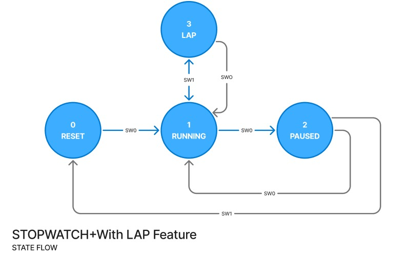

# **Detailed Project Documentation – Stopwatch Using 8051**


*Part 1 – System Overview & Architecture*
---

## **1. Introduction**

This project implements a **digital stopwatch using the 8051 microcontroller**, featuring:

* **Start / Pause / Reset** operations
* **Lap functionality**
* **1-second timing using Timer1**
* **LCD-based time display**
* **Interrupt-driven state transitions**
* **Power-saving Idle Mode (PCON register)**

The goal is to understand how **interrupts, timers, state machines, debouncing, and LCD interfacing** work together to build this project.

---

## **2. System Workflow**

The stopwatch operates across **four main states**:

| State           | Meaning           | Description                                         |
| --------------- | ----------------- | --------------------------------------------------- |
| **0 – RESET**   | Reset             | Displays `00:00`, clears counters, enters Idle mode |
| **1 – RUNNING** | Stopwatch running | Counts time every second                            |
| **2 – PAUSED**  | Pause state       | Freezes display, enters Idle mode                   |
| **3 – LAP**     | Lap display       | Shows "LAP" temporarily while timer keeps running   |

### **Input Buttons → Interrupt Controlled**

| Button  | Interrupt | Action                                      |
| ------- | --------- | ------------------------------------------- |
| **SW0** | INT0      | Start ↔ Pause ↔ Running ↔ Reset transitions |
| **SW1** | INT1      | Running ↔ Lap transitions                   |

---

## **3. Timing Logic**

The 8051 cannot generate a full **1-second delay** directly using Timer1, so we generate:

```
20 overflows × 50ms each = 1 second
```

* Timer1 → Mode 1 (16-bit)
* TH1 = `0x4C`
* TL1 = `0x00`

Registers used:

| Register    | Purpose                                   |
| ----------- | ----------------------------------------- |
| **R5**      | Minutes                                   |
| **R6**      | Seconds                                   |
| **R7 / R1** | 50ms overflow counter                     |
| **30H**     | Current stopwatch state                   |
| **31H**     | Previous state (used for lap/reset logic) |

---

## **4. Hardware Components**

The full system uses:

* **Microcontroller:**

  * AT89C51RD2 (Proteus simulation)
  * P89V51RD2 (Physical hardware)

* **Display:** 16x2 LCD (8-bit mode)

* **Buttons:**

  * SW0 → INT0 (P3.2)
  * SW1 → INT1 (P3.3)

* **Clock:** 11.0592 MHz crystal

* **Software Tools:**

  * Keil uVision5 (Assembly code)
  * Proteus 8 (Simulation)

---

## **5. LCD Commands Used**


Used in our code:

| Command | Description                   |
| ------- | ----------------------------- |
| `0x38`  | 8-bit mode, 2-line display    |
| `0x0E`  | Display ON, cursor ON         |
| `0x01`  | Clear display                 |
| `0x06`  | Entry mode (increment cursor) |
| `0x80`  | Set cursor to 1st row         |
| `0xC0`  | Set cursor to 2nd row         |

LCD interfacing is done through:

* `COMNWRT` → Sends LCD command
* `DATAWRT` → Sends character data
* Uses P1 as data bus, P2.0–P2.2 as control pins


---

## **6. Features Implemented**

### ✔ **Accurate 1-second counting**

Using Timer1 + overflow counter.

### ✔ **Lap feature**

Time continues internally, display switches to LAP text temporarily.

### ✔ **Pause state**

Freezes time onscreen while Timer1 continues to run in background.

### ✔ **Idle Power Saving (PCON)**

Used in:

* Reset state
* Paused state

Helps reduce power by halting CPU while keeping peripherals active.

### ✔ **Debounced Inputs**

Debounce delay prevents repeated interrupt triggers.

### ✔ **Clean State Machine**

Handles transitions exactly:

```
RESET → RUNNING → PAUSED → RUNNING → LAP → RUNNING → PAUSED → RESET
```
---
*Part 2 – Interrupts, Timers, LCD Logic & Complete State Machine*
---


# **1. Timer Operation**

###  **Why Timer1 (Mode 1) was used**

* 16-bit timer → max count = 65536
* Machine cycle (with 11.0592 MHz crystal):

  ```
  1 machine cycle = 12 clock cycles
  → 1 machine cycle ≈ 1.085 µs
  ```
* Full overflow time:

  ```
  65536 × 1.085 µs ≈ 71.1 ms
  ```
* **1 second is too long**, so we count:

  ```
  20 overflows × 50 ms = 1 second
  ```

###  **Timer Reload Values**

```
TH1 = 4CH  
TL1 = 00H  
```

This results in approximately **50 ms** per overflow.

###  **Overflow Counter Register**

  Overflow counter  -  R7              

---

# **2. Timer1 ISR Workflow (Final Code)**

```
TIMER1_ISR:
    INC R7                 ; Count overflows
    CJNE R7, #20, SKIP
    MOV R7, #0
    SETB 30H               ; Set “1-second-complete” flag
SKIP:
    MOV TH1, #4CH
    MOV TL1, #00H
    CLR TF1
    RETI
```

###  **Meaning**

* Every 50ms → R7 increments
* After 20 overflows → `30H` is set = 1 second complete
* Main loop checks this flag to update time

This is a **clean and accurate 1-second generator**.

---

# **3. Interrupt System**

## **3.1 INT0 (Start / Pause / Toggle)**

Connected to: **P3.2**

Triggered by: **SW0**

This ISR handles transitions:

```
RESET → RUNNING
RUNNING → PAUSE
PAUSE → RUNNING
LAP → RUNNING
```

Our code uses **R2** for LAP clearing.

---

## **3.2 INT1 (Lap / Exit Lap / Reset)**

Connected to: **P3.3**

Triggered by: **SW1**

Transitions:

```
RUNNING → LAP
LAP → RUNNING
PAUSE → RESET
```

This allows PAUSE to act like long-press reset in commercial stopwatches.

---

## **3.3 Debouncing Logic**

Debouncing prevents false triggers:

```
DEBOUNCE_DELAY:
    MOV R3, #20
LOOP1:
    MOV R4, #250
LOOP2:
    DJNZ R4, LOOP2
    DJNZ R3, LOOP1
    RET
```

This gives ~10–15 ms of debounce time.

---

# **4. State Machine (Final Code Version)**


| State | Name    | Description                     |
| ----- | ------- | ------------------------------- |
| **0** | RESET   | Shows 00:00, clears registers   |
| **1** | RUNNING | Time increments every second    |
| **2** | PAUSED  | Time freezes, Idle mode enabled |
| **3** | LAP     | Display shows LAP temporarily   |


## **4.1 RESET State**

* Prints `00:00`
* Clears R5, R6
* Enters Idle mode to save power

```
ORL PCON, #01H
NOP
NOP
NOP
;NOP used 3 times as per rules
```

---

## **4.2 RUNNING State**

Updates time only if Timer1 ISR sets the flag:

```
JNB 30H, SKIP
CLR 30H
INC R6
CJNE R6, #60, SKIP
MOV R6, #0
INC R5
```

Also performs:

* Display update
* Clearing LAP text once if needed (via `R2` or `R0`)

---

## **4.3 PAUSED State**

```
ACALL DISPLAY_TIME
ORL PCON, #01H   ; Idle mode
```

✔ LCD stays frozen
✔ CPU sleeps
✔ Wakes on interrupt

---

## **4.4 LAP State**

Timer keeps running internally:

```
INC R6
INC R5 (if sec = 60)
```

But display shows:

```
LAP
```

Using:

```
PRINT_LAP:
    MOV A, #8DH
    ...
```

Since LCD DDRAM address 8D is on Row 1, Col 14.

---

# **5. LCD Logic**

## **5.1 LCD Pin Usage**

| Signal | 8051 Pin |
| ------ | -------- |
| D0–D7  | P1       |
| RS     | P2.1     |
| RW     | P2.0     |
| EN     | P2.2     |

## **5.2 Command Writing**

```
RS = 0
RW = 0
EN = 1 → 0
```

## **5.3 Data Writing**

```
RS = 1
RW = 0
EN = 1 → 0
```

Both routines internally call a *delay* to meet LCD timing requirements.

---

# **6. Time Formatting & ASCII Logic**

LCD cannot print numbers directly from registers.

So the stopwatch converts:

Example: R5 = 34 (minutes)

```
34 / 10 → Tens = 3
34 % 10 → Ones = 4
Convert to ASCII:
3 + '0' → '3'
4 + '0' → '4'
```

This conversion is done using:

```
MOV B, #10  
DIV AB    
```

This is used for both MINUTES (R5) and SECONDS (R6).

---

# **7. Clearing and Reprinting LAP Text**

When returning from LAP → RUNNING:

```
DJNZ R2, CLEAR_LAP
```

CLEAR_LAP overwrites the characters:

```
' ' ' ' ' '
```

This ensures LAP is removed cleanly **only once**, and not repeatedly.

---

# 8. FINAL LOGIC DIAGRAM 



